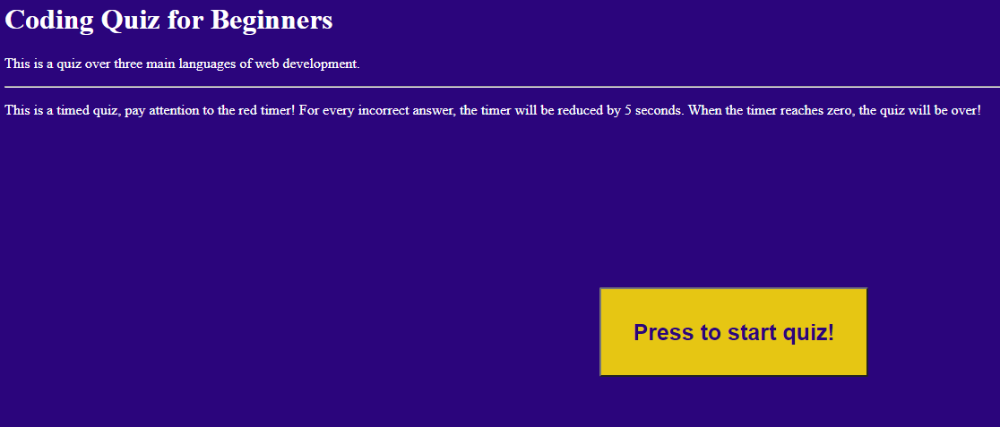

# Coding-Quiz

GIVEN a user is taking a code quiz
WHEN user clicks the start button
THEN a timer starts and user is presented with a question
WHEN user answers a question
THEN user is presented with another question
WHEN user answers a question incorrectly
THEN time is subtracted from the clock
WHEN all questions are answered or the timer reaches 0
THEN the quiz is over
WHEN the quiz is over
THEN the user can save user initials and score

